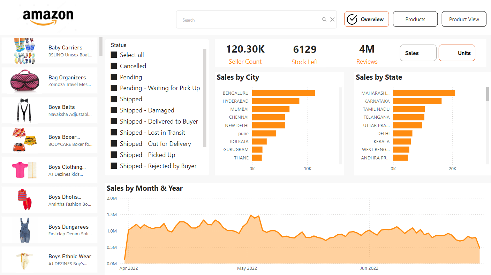

# Amazon Sales Dashboard Using Power BI

The "Amazon Sales Dashboard" is a comprehensive analytics tool built using Power BI.
It is designed to provide a detailed analysis of sales performance on Amazon. The dashboard allows users to gain insights into various sales metrics, 
shipping statuses, product information, and return data, all within a single interactive interface. 
This project is ideal for stakeholders who need to monitor and optimize sales strategies, track product performance, and make data-driven decisions.

# Key features include :

# Product Slicer:
A slicer to filter for newly added products.
# Product Information Table:
A comprehensive table displaying product images, names, and descriptions for easy reference.
Shipping, Cancellation, and Return Status Slicer: A slicer list to filter data based on the shipping status, cancellations, and returns.
# Text Search Slicer:
A convenient text search feature to quickly locate specific products within the dataset.
# Page Navigator Button:
A button that allows seamless navigation to the next page of the dashboard.
# Sales/Units Slicer:
A slicer that lets users toggle between viewing sales figures and units sold.
# Clustered Bar Charts:
Two bar charts showcasing sales data by city and state, providing geographical insights.
# Area Chart:
A dynamic area chart that tracks sales trends over time, displayed by month and year.

# Use Cases
Sales Monitoring: Track the overall sales performance, identify top-selling products, and understand geographical sales distribution.
Supply Chain Analysis: Analyze shipping statuses, cancellation rates, and return information to optimize logistics and customer satisfaction.
Product Performance Review: Monitor how new products are performing compared to existing ones and make data-driven decisions on product launches.
Trend Analysis: Use the area chart to identify seasonal trends, peak sales periods, and other time-based sales behaviors.

# Technology Stack

Power BI: The dashboard is built entirely using Power BI, leveraging its powerful data visualization capabilities to create an interactive and user-friendly interface.
Data Sources: The project can be connected to various data sources, such as SQL databases, CSV files, or direct integrations with Amazon's sales data.

# Conclusion

The "Amazon Sales Dashboard" is a powerful tool for any Amazon seller or business analyst looking to dive deep into their sales data. 
By providing a comprehensive view of sales performance across multiple dimensions, this dashboard helps users make informed decisions, 
optimize sales strategies, and ultimately drive business growth.

This dashboard is an essential tool for analyzing and optimizing Amazon sales strategies, offering a comprehensive view of sales performance across various dimensions.

# Power Bi | Dashboard  |  Visualization  |  Data Analysis 
